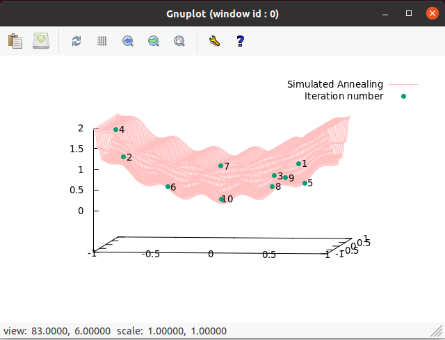
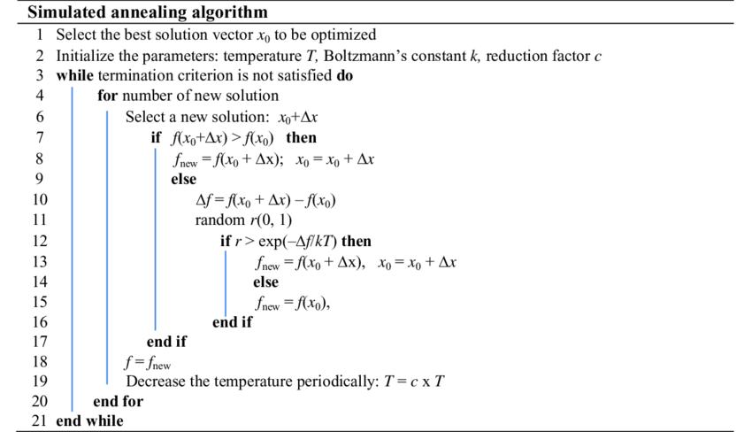

# Optimization
## Simulated Annealing
A demo of optimiziation in a 2D surface using Simulated Annealing

In Simulated annealing (SA), an optimization problem is modeled as a physical process of heating a material and then slowly cooling to decrease defects, thus finding the minimum energy of the system.

In the SA algorithm, a new point is randomly generated at each iteration. Then the distance of the new point from the current point, anf thesearch range, are then calculated based on the Boltzmann Distributipon. New points that lower the objective will then be accepted. To deal with local minima issues, a proportion of points that raise the objective are also considered. The algorithm is summarized as shiwn below.

I implemented this algorithm in C++ using the C++ STL library. For visualization I used GNUPlot with the gnulpot-iostreaming library. The result of optimizing on a 2D surface is shown about. This demo runs ten iterations and finds a reasonable minimum.

### References
1. https://au.mathworks.com/discovery/simulated-annealing.html
